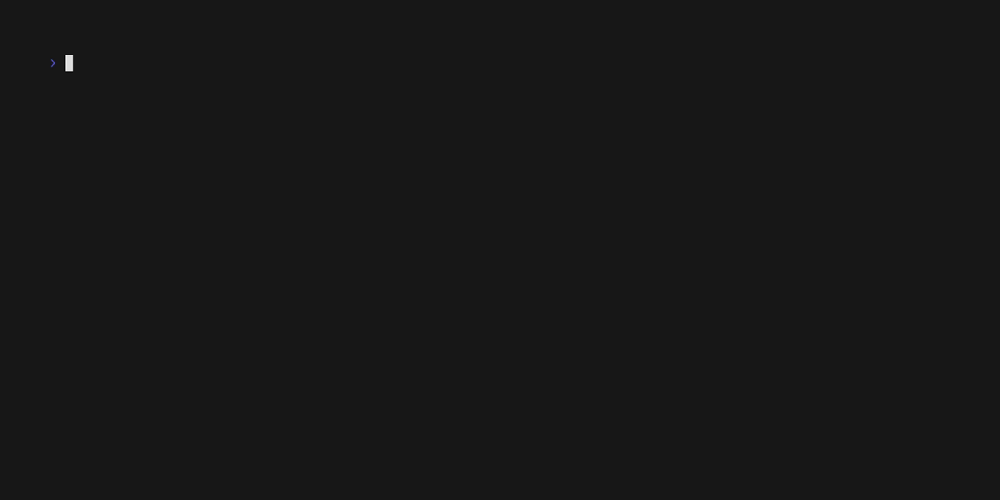

# fsck

`fsck` is a simple tool for verifying the integrity of a [`tlog-tiles`](https://c2sp.org/tlog-tiles) log.

It is so-named as a nod towards the 'nix tools which perform a similar job for filesystems.
Note, however, that this tool is generally applicable for all tlog-tile instances accessible
via a HTTP, not just those which _happen_ to be backed by a POSIX filesystem.

## Usage

The tool is provided the URL of the log to check, and will attempt to re-derive 
the claimed root hash from the log's `checkpoint`, as well as the contents of all
tiles implied by the tree size it contains.

It can be run with the following command:

```bash
$ go run github.com/transparency-dev/tessera/cmd/fsck@main --storage_url=http://localhost:2024/ --public_key=tessera.pub
```



Optional flags may be used to control the amount of parallelism used during the process, run the tool with `--help`
for more details.

